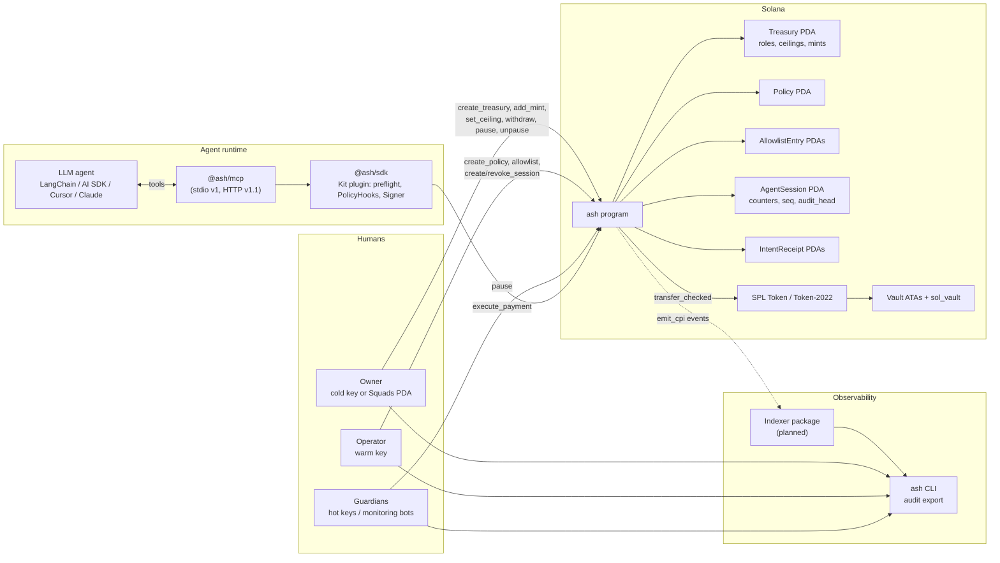
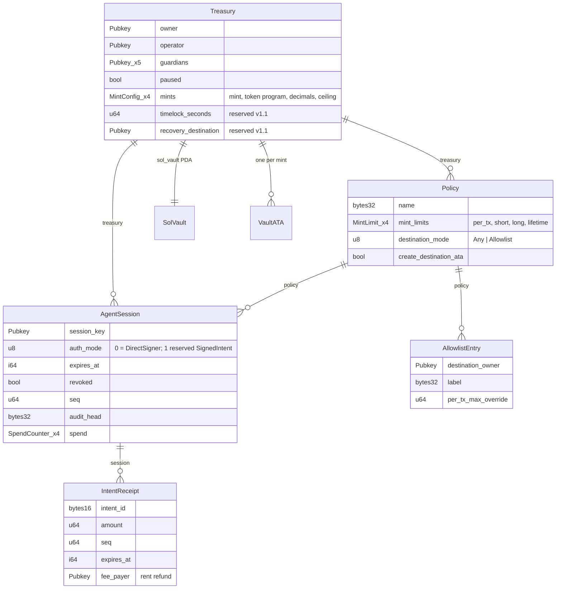

# ASH — Architecture

**Status:** v1 design baseline (frozen for implementation). Decisions are recorded as ADRs in [`docs/adr/`](docs/adr/README.md); the byte-level account and instruction contract is in [`docs/spec/accounts-and-instructions.md`](docs/spec/accounts-and-instructions.md).

ASH is a guardrail and treasury framework that lets autonomous AI agents make on-chain payments without ever holding unbounded funds. Treasury owners deposit into a program-owned vault, define a policy (per-transaction, windowed, and lifetime limits; destination allowlists; mint allowlists), and issue time-boxed agent sessions. Agents pay through a single `execute_payment` instruction that the program refuses unless every rule holds. Humans keep three separated powers: withdraw (owner), configure within ceilings (operator), and stop (guardians). Every payment is idempotent, and every session carries a tamper-evident audit chain.

---

## 1. Goals and non-goals

### Goals

- **Bounded blast radius.** A fully compromised agent (leaked key, prompt injection, buggy retry loop) can lose at most what the policy allows in the current windows. Nothing an agent can call loosens its own constraints.
- **Trust-minimized enforcement.** Limits, allowlists, idempotency, and the kill switch are enforced by the on-chain program, not by an off-chain proxy. Off-chain checks exist only as defense in depth.
- **Zero external program dependencies.** The program CPIs only into SPL Token / Token-2022, the Associated Token Account program, and the System program.
- **Verifiable audit trail.** Payments are committed into a per-session hash chain; an indexer's log can be checked against on-chain state.
- **First-class agent DX.** A Model Context Protocol (MCP) server and framework adapters expose a small, safe tool contract with human units and machine-readable denial reasons.
- **Enterprise-grade engineering.** Pure, formally checked policy arithmetic; stateful fuzzing; reproducible builds; staged trust for program upgrades.

### Non-goals (v1)

- Being a general-purpose multisig or DAO treasury. Owners who want M-of-N control set `owner` to a Squads or Realms PDA.
- Human-in-the-loop approvals, timelocked policy loosening, signed-intent/relayer mode (all reserved in state for v1.1).
- Token-2022 mints with `TransferHook` or `ConfidentialTransfer` extensions.
- Native Python signing. Python is MCP-first in v1.
- A turnkey hosted SaaS with billing (the `packages/dashboard` operator UI exists for
  local and self-hosted use; ADR-017 covers tenancy, not commercial packaging).

---

## 2. System overview



### Components

Shipped paths are what exist under this monorepo today. Rows marked **planned** are
design targets from ADR-009 and the roadmap below; they are not missing directories
you should expect to clone.

| Component | Location | Responsibility |
|---|---|---|
| `ash` program | `programs/ash` | Account validation, PDA custody, CPI to token programs, event emission. Thin: delegates all policy decisions to the policy crate. |
| `ash-policy` crate | `crates/ash-policy` | Pure, `#![no_std]`-compatible, `#![forbid(unsafe_code)]` policy arithmetic: window rollover, limit checks, ceiling partial order, audit hash. Property-tested, fuzzed, model-checked. |
| `ash-client` crate | **planned** (`crates/ash-client`) | Codama-generated Rust client for relayers and indexers. |
| `@ash/contract` | `packages/contract` | Zod schemas for MCP tools, reason codes, event types; JSON Schema export. Single source of truth for every off-chain surface. |
| `@ash/client` | `packages/client` | Codama-generated `@solana/kit` client. No hand-written code. |
| `@ash/sdk` | `packages/sdk` | Kit plugin (`client.use(ash(...))`): `Signer` interface, `PaymentIntent` builder, decimals conversion, preflight simulation, `PolicyHook`s, error mapping; `verifyAuditChain` and receipt reads. |
| `@ash/mcp` | `packages/mcp` | MCP server core with stdio transport (v1) and Streamable HTTP (v1.1). Agent-facing tools only. |
| `@ash/indexer` | **planned** (`packages/indexer`) | Pluggable `EventSource` (polling, Yellowstone) and `Sink` (SQLite, Postgres); long-retention `verifyChain`. **Today:** CLI `audit export --verify`, SDK `verifyAuditChain`, dashboard metrics history via RPC log walk (windowed). |
| `ash` CLI | `packages/cli` | Owner / operator / guardian commands, `init` bootstrap, `audit export`, `doctor`, day-2 operator commands. |
| `@ash/dashboard` | `packages/dashboard` | Chat-first operator UI; privileged writes allowlisted per ADR-021. |
| `@ash/adapter-vercel-ai` | `packages/adapters/vercel-ai` | Vercel AI SDK `tool()` wiring for `AGENT_TOOL_NAMES`; schemas from `@ash/contract`, handlers injected (ADR-009). |
| Other framework adapters | **planned** (`packages/adapters/{langchain,openai-agents}`) | Same thin pattern as the Vercel package. **Today:** MCP stdio or `@ash/adapter-vercel-ai`. |
| Python package | **planned** (`python/ash`) | MCP client wrapper plus LangChain / CrewAI / pydantic-ai tool wrappers (ADR-009). |

---

## 3. Trust model and roles

The program recognizes four principals per treasury. Each is a plain `Pubkey`, so any of them may be a hardware wallet, a Squads vault PDA, a Realms governance PDA, or a bot.

| Role | Temperature | Can | Cannot |
|---|---|---|---|
| **Owner** | Cold | Withdraw (any mint, any amount, any destination, even while paused); rotate owner/operator; add/remove guardians; add/remove mints (extension gate); set `PolicyCeiling`; pause; unpause; close treasury | Execute agent payments |
| **Operator** | Warm | Create/update/close policies within the ceiling; manage allowlist entries; create/revoke/close sessions | Withdraw; raise ceilings; add mints; change roles; pause; unpause |
| **Guardian** (up to 5) | Hot | Pause | Anything else. Guardians can only tighten. They cannot unpause. |
| **Agent session** | Hot | `execute_payment` within its policy and session window | Any configuration change |

Design invariants:

- **Loosening flows downhill only.** Owner sets ceilings; operator sets policy `≤` ceiling; the agent sets nothing.
- **Pause is an agent kill switch, not an owner lock.** `paused` blocks `execute_payment` only. Owner withdrawal always works; this is the emergency exit. Pause is owner-or-guardian; unpause is owner-only. The operator cannot pause or unpause: a compromised warm key already has `revoke_session`, and must not be able to freeze the treasury or to undo a guardian's pause.
- **The agent-facing surface has zero privilege-escalating tools.** `create_session`, `update_policy`, `unpause`, `withdraw`, and allowlist edits do not exist in the MCP server or adapters.
- **Two independent stops.** Any guardian can pause; the operator can revoke the session. Either alone is sufficient. Only the owner can clear a pause.

Reserved for v1.1 ("loosening is slow, tightening is instant"): `Treasury.timelock_seconds` and `Treasury.recovery_destination`. When enabled, loosening actions (raise limits, add allowlist entry, extend session, withdraw to a non-recovery destination) enter a `PendingChange` with a delay and guardian veto; tightening actions remain instant.

---

## 4. Payment flow

```mermaid
sequenceDiagram
  participant A as LLM agent
  participant M as MCP server / SDK
  participant P as ash program
  participant T as Token program

  Note over M: treasury, policy, session and the destination<br/>index are bound at startup, not passed per call

  A->>M: check_payment(destination_ref, "12.50", "USDC", reference)
  M->>M: label → owner pubkey (exact match against the on-chain allowlist)
  M->>M: human units → base units via MintConfig.decimals
  M->>M: intent_id = H(session, owner, mint, amount, reference)
  M->>P: read IntentReceipt PDA (already settled?)
  P-->>M: absent
  M->>M: run PolicyHooks (soft, off-chain; deny on timeout)
  M->>P: simulate execute_payment(PaymentIntent)
  P-->>M: ok / AnchorError(code)
  M-->>A: { allowed, reason_code, intent_id, receipt }

  A->>M: execute_payment(destination_ref, "12.50", "USDC", reference)
  M->>M: governor: one in flight, within rate budget, not quiesced
  M->>M: same inputs → same intent_id; re-read pause and revocation
  M->>P: execute_payment(PaymentIntent), signed by the session key
  P->>P: not paused; session signer, active, unexpired
  P->>P: mint ∈ treasury; limit slot ∈ policy; destination allowed
  P->>P: init IntentReceipt (fails on duplicate intent_id)
  P->>P: policy crate: rollover windows, check per-tx/short/long/lifetime
  P->>T: transfer_checked(vault → destination ATA) or system transfer (sol_vault)
  P->>P: update counters, seq += 1, audit_head = H(...)
  P-->>M: emit_cpi PaymentExecuted{seq, audit_head, ...}

  alt confirmation observed
    M-->>A: { outcome: settled, intent_id, receipt, signature }
  else not observed before the deadline
    M->>P: poll IntentReceipt PDA (did it land?)
    P-->>M: absent
    M->>M: quiesce the session until this intent resolves
    M-->>A: { outcome: indeterminate, intent_id, receipt, next_step }
  end
```

The second path is the one that matters. Nothing about an unobserved confirmation says the transfer did not happen, so the agent is told exactly that and is refused further payments until `get_payment_status` settles it. A retry would in any case re-derive the same `intent_id` and be refused on-chain at receipt creation.

`execute_payment` is a single-hop transaction: one program instruction and one token CPI. Budget targets: ≤ 40k CU and ≤ 600 bytes with legacy account addressing (see spec §7). Versioned transactions with an address lookup table are an SDK option, not a requirement.

---

## 5. Account model

Full layouts, seeds, sizes, and reserved fields are in the [spec](docs/spec/accounts-and-instructions.md). Summary:



Key modeling choices:

- **`Treasury` is the vault authority.** Vaults are its ATAs (one per configured mint) plus a system-owned `sol_vault` PDA for native SOL. No separate authority PDA.
- **Rules vs. state.** `Policy` (operator-writable, ceiling-bounded) holds rules. `AgentSession` (program-writable only) holds spend counters, sequence number, and audit head. Many sessions may share one policy without sharing budgets.
- **Unbounded allowlist, O(1) check.** One `AllowlistEntry` PDA per destination *wallet owner*, verified by seeds. The program derives the destination ATA itself, so an agent can never be pointed at a look-alike token account.
- **Idempotency by construction.** `IntentReceipt` is `init`-ed at `["receipt", session, intent_id]`; a duplicate fails before any transfer. Receipts are closeable permissionlessly after expiry; rent returns to `fee_payer`.
- **Versioned, padded accounts.** Every account carries `version: u8` and a reserved byte block so v1.1 features land without migrations. Layout is snapshot-tested in CI.

---

## 6. Policy engine

Policy evaluation is a pure function in `ash-policy`. The Anchor handler validates accounts, calls the crate, and applies the returned state.

### Limits

Per policy, up to four `MintLimit` slots (USDC, USDT, wSOL/native SOL, one spare). Each slot defines:

| Field | Meaning |
|---|---|
| `per_tx_max` | Maximum single payment |
| `short_window_max` / `short_window_seconds` | Velocity cap (e.g. per hour) |
| `long_window_max` / `long_window_seconds` | Budget cap (e.g. per day) |
| `lifetime_max` | Total a single session may ever spend of this mint (the "give this agent $500 for this task" allowance) |
| `approval_threshold`, `cooldown_seconds` | Reserved v1.1 (human-in-the-loop; minimum spacing between payments) |

Windows are **fixed epoch buckets**, not rolling: `window_start` advances by whole multiples of `window_seconds` and the spent counter resets. Buckets are trivially verifiable and cheap; rolling windows need ring buffers that cost CU and resist fuzzing.

### Ceiling partial order

The owner's `MintConfig.ceiling` bounds what the operator may configure. `update_policy` asserts `Policy ≤ Ceiling`, defined per mint slot as:

```
per_tx_max          ≤ ceiling.max_per_tx
short_window_max    ≤ ceiling.max_short_window
long_window_max     ≤ ceiling.max_long_window
lifetime_max        ≤ ceiling.max_lifetime
short_window_seconds ≥ ceiling.min_short_window_seconds   (a longer window with the same cap is tighter)
long_window_seconds  ≥ ceiling.min_long_window_seconds
destination_mode == Any        ⇒ treasury.allow_any_destination
create_destination_ata == true ⇒ treasury.allow_create_destination_ata
```

### Destinations

`destination_mode ∈ {Any, Allowlist}`. In `Allowlist` mode the client passes the `AllowlistEntry` PDA for the destination owner; the program verifies seeds and applies `per_tx_max_override` if non-zero. `Any` mode is permitted only if the ceiling allows it and is intended for tightly limited policies.

### Mints and extensions

Mints are configured at the treasury level by the owner via `add_mint`, which is the Token-2022 extension gate. Rejected: `TransferHook`, `ConfidentialTransfer`, `NonTransferable`. Allowed: `TransferFee` (limits apply to the amount debited from the vault), `MetadataPointer` / `TokenMetadata`, `InterestBearing`, `DefaultAccountState`, `PermanentDelegate` (CLI warns). The configured token program id is stored per mint and asserted in `execute_payment`.

Native SOL is addressed by the native-mint sentinel `So11111111111111111111111111111111111111112` and paid from `sol_vault` via System program transfer with PDA signer seeds; `sol_vault` keeps an unspendable rent-exempt floor.

### Soft policies (defense in depth)

The SDK and MCP server run `PolicyHook`s before signing: pluggable functions (custom, Cedar, OPA) for contextual rules the chain cannot see (open invoices, business hours, per-task budgets). Denials are logged with the same event shape as on-chain events. Documentation states plainly that soft policies are not the guarantee.

---

## 7. Idempotency and replay protection

Solana already rejects byte-identical transactions within the blockhash window. The threat is the *agent retry*: a tool call times out, the transaction actually landed, and the agent re-issues the same logical payment with a fresh blockhash.

The receipt only refuses a retry that carries the *same* `intent_id`, so where that id comes from is part of the guarantee rather than a client detail (ADR-012).

- `PaymentIntent.intent_id: [u8; 16]` is **derived, never drawn at random**: `sha256("ash:intent:v1" ‖ session ‖ destination_owner ‖ mint ‖ amount ‖ reference)[0..16]`, every field length-prefixed. The session is in the preimage so a hostile `reference` cannot be aimed at another session's receipts. `reference` is the caller's name for what is being settled (invoice number, document hash, task id); it is required and has no default, because a generated one puts the system back on random ids.
- A retry of the same payment therefore collides on the same receipt by construction. Changing any payment parameter yields a different id — correct, because that is a different payment, bounded by the window and lifetime limits rather than by idempotency.
- `execute_payment` `init`s `IntentReceipt` at `["receipt", session, intent_id]`. Duplicate → account-creation failure → no transfer.
- `PaymentIntent.expires_at` is mandatory, short, and **server-authored** (90 s default, program max 1 h), so the replay window is not something a caller chooses.
- Receipts answer "did it land?" authoritatively: `get_payment_status(intent_id)` reads the PDA first and, once the receipt account is closed, falls back to indexed or replayed history (CLI `audit export`, future `@ash/indexer`). The SDK prechecks the receipt before building, so a retry of a settled payment costs nothing.
- `close_receipt` is permissionless after `expires_at + RECEIPT_GRACE_SECONDS`; rent returns to the `fee_payer` recorded in the receipt. A derived id is stable indefinitely, so beyond that window a precheck must consult event history, not the PDA alone.
- In v1.1 signed-intent mode, the same `intent_id` doubles as the replay nonce because the Ed25519 signature covers it.

### Outcomes

Idempotency is only reachable if a client can tell "this did not happen" from "I do not know". A payment attempt ends in one of four states (ADR-012):

| Outcome | Meaning | Permitted next step |
|---|---|---|
| `settled` | The transfer is on-chain, from this attempt or an earlier one | None |
| `denied` | A rule refused it; nothing moved | Change something and retry |
| `indeterminate` | Broadcast, unconfirmed | Resolve the receipt. **Never retry** |
| `review_required` | Held for a human | None; terminal for the agent |

Classification follows what a failure *proves*, not where it was raised: a preflight failure or an included-and-reverted transaction is `denied`, and anything raised after a successful broadcast is `indeterminate`. Resolution reads the receipt PDA with `searchTransactionHistory: true`, and until it succeeds the session is quiesced — further payments are refused rather than guessed at.

---

## 8. Audit log

- **Events.** One versioned `AshEvent` enum emitted via `emit_cpi!` (inner-instruction data, not truncatable logs). Every payment-related variant carries `treasury`, `session`, `seq`, and `audit_head`.
- **Hash chain.** `AgentSession.seq` increments per executed payment; `audit_head = sha256(DOMAIN ‖ prev_head ‖ seq ‖ intent_id ‖ mint ‖ destination_owner ‖ amount ‖ slot)`. 40 bytes of state, one `hashv` syscall, no new write locks (the session is already writable per payment).
- **Verifiability.** `verifyAuditChain` in `@ash/sdk` (and the policy crate in Rust) recomputes the chain from `PaymentExecuted` events and compares to on-chain `audit_head`. CLI `ash audit export --verify` does the same for operators. A dedicated `@ash/indexer` package (planned) would persist events past RPC retention; dropped or forged entries are detectable either way; `seq` gaps are detectable without hashing.
- **Denials.** Policy violations caught in preflight never reach the chain; the SDK/MCP server logs `PaymentDenied { reason_code, intent }` to a structured JSON sink using the same schema, so one downstream pipeline sees both outcomes.
- **Human view.** CLI `audit export`, JSONL sinks, and the dashboard `/metrics` page (best-effort history plus exact counters from session state).

---

## 9. Agent authentication

v1 uses **direct session signing**: the operator registers `session_key` in `AgentSession`; the agent (or a signer service acting for it) signs `execute_payment` with that key. The program checks `session_key.is_signer && !revoked && now < expires_at`.

Forward-compatibility decisions already in place:

- `execute_payment`'s instruction data *is* a canonical `PaymentIntent` struct, including `intent_id` and `expires_at`.
- `AgentSession.auth_mode` is reserved (`0 = DirectSigner`; `1 = SignedIntent` in v1.1, where the agent signs the Borsh-serialized intent off-chain, a relayer submits `[Ed25519Program.verify, execute_payment]`, and the program introspects the instructions sysvar).
- `fee_payer` is a separate account from `session_key`, so operator-sponsored fees work today and relayers slot in later.
- The SDK's `Signer` type is Kit's `TransactionPartialSigner`; `KeypairSigner` (file/env) and `RemoteSigner` (generic HTTP signing endpoint) ship in v1, and any Kit-compatible signer (Turnkey, wallets, enclaves) works without glue.

---

## 10. MCP surface

One server core, two transports: stdio (v1, `npx @ash/mcp`, bound to one session via env) and Streamable HTTP (v1.1, `SessionResolver` maps bearer token → session + signer). Tool schemas are identical across transports and adapters because all import `@ash/contract`.

The server binds one session at startup and derives the treasury, policy, mint table and destination index from the chain. None of those are tool arguments: they are the most privileged fields in the payload, and a tool argument is the part of the payload an injected instruction can reach. Startup fails, before the transport connects, if the session does not exist, the configured signer is not its `session_key`, the session is revoked or expired, or an `Allowlist` policy has no registered destinations.

| Tool | Kind | Notes |
|---|---|---|
| `get_session` | read | Status, expiry, sequence, per-mint spend counters. No arguments |
| `get_policy` | read | Limits, destination mode, memo requirement. No arguments |
| `list_destinations` | read | Labels this session may pay, with resolved owners |
| `get_balance(mint)` | read | Vault balance *(not yet implemented)* |
| `get_payment_status(intent_id)` | read | Receipt first, indexer fallback. Resolves an indeterminate outcome and lifts the quiesce |
| `list_payments` | read | Indexer-backed; degrades to "unavailable" *(not yet implemented)* |
| `check_payment(destination_ref, amount, mint_ref, reference, memo?)` | dry run | Same resolution, hooks and simulation as a real payment; sends nothing |
| `execute_payment(destination_ref, amount, mint_ref, reference, memo?)` | write | Resolve, derive intent, precheck receipt, hooks, simulate, send, resolve; returns `outcome`, `intent_id`, `receipt`, `signature` |
| `request_limit_increase(reason, mint_ref?, amount?)` | message | Emits `limit_increase_requested` to the operator's dashboard; grants nothing (ADR-022) |

Contract hygiene: amounts are decimal strings in human units, converted against `MintConfig.decimals` in trusted code with integer arithmetic — excess precision denies rather than rounds. Destinations are **labels, not addresses**: resolution is exact match on an NFKC-normalized label against the on-chain allowlist, with no fuzzy matching, and a raw pubkey is refused outright unless the policy is in `Any` mode. `expires_at` and the token program are server-authored. Every response carries `outcome`, `intent_id` and `receipt` — denials included, since without the id the receipt is unreachable — and every denial carries a `reason_code`. Program logs and raw errors never return to the agent; they go to the operator's structured sink, sharing the on-chain event schema. Resources `ash://session/{pubkey}` and `ash://policy/{pubkey}` mirror the read tools; one prompt, `payment-guidelines`, teaches the check-then-execute pattern.

A local governor caps concurrency at one payment in flight — two in flight can each pass a limit check the pair of them violates — and applies a rolling per-minute budget. These are advisory: whoever owns the process owns the governor, and the program remains the guarantee.

Deliberately absent from any agent-facing surface: session creation, policy edits, allowlist edits, unpause, withdraw. `request_limit_increase` only emits an off-chain event (ADR-022). With an ingest URL and token configured, the server also reports denials and `human-review` holds to the dashboard, where a person approves a held payment by its intent id; the agent's identical retry then goes through.

---

## 11. Testing and CI

Layered pyramid (ADR-008):

1. `ash-policy`: `proptest`, `cargo-fuzz`; Kani bounded model checking nightly (no overflow, monotone rollover, `≤` is a partial order, chain hash injective in `seq`).
2. `anchor-litesvm` Rust integration tests: every instruction, every adversarial path, clock warps.
3. Trident stateful fuzzing with invariants (vault balance vs. receipts; counters ≤ limits; `Policy ≤ Ceiling`; paused ⇒ no payment; revoked/expired never pays; `seq`/`audit_head` consistency; receipts never re-init; non-role signers cannot mutate).
4. `litesvm` npm for SDK and MCP tests; MCP contract tests via in-memory transport; tool-schema snapshots.
5. Surfpool E2E nightly with mainnet-forked USDC; devnet smoke on release tags.

Per-PR gates: fmt, clippy `-D warnings`, cargo-deny/audit, verifiable build hash, CU regression (>10% over committed budget fails), account layout snapshot, IDL diff comment, short Trident run, tsc/Biome/vitest, coverage thresholds (policy crate ≥95%, SDK core ≥85%), CodeQL, semgrep, pinned Actions. Nightly: long Trident, Kani, Surfpool E2E, `cargo-mutants`.

---

## 12. Governance, versioning, release posture

Staged trust (ADR-011):

| Phase | Upgrade authority | README banner |
|---|---|---|
| `0.x` | Maintainer multisig, devnet only | "Unaudited. Do not use on mainnet." |
| `1.0.0-beta` | Squads 3-of-5 (incl. ≥1 external security signer) with on-chain time lock, ≥72 h public notice | "Upgradeable by 3-of-5 with 72 h notice. Keep balances small." |
| `1.0.0` | `None` (frozen) after professional audit + soak | "Immutable. Verify with `solana program show`." |
| `2.x` | New program id; treasuries opt in via `migrate_treasury` | — |

- One program keypair for devnet and mainnet (`rail…` vanity prefix), generated offline, held by the multisig custodians; only the pubkey in the repo.
- Program `PROGRAM_VERSION: u8`; every account carries `version: u8`. IDL published on-chain via Program Metadata and as a release asset. `@ash/*` packages use independent semver via Changesets; `@ash/contract` is the compatibility anchor; `ash doctor` checks on-chain IDL hash vs. client.
- Apache-2.0 everywhere; DCO sign-off; `CODEOWNERS` with two reviews for `programs/` and `crates/ash-policy/`; signed commits; `GOVERNANCE.md`, `SECURITY.md`, `THREAT_MODEL.md`.
- Audit: internal pre-audit (threat model, Sealevel-attacks checklist, static analysis, fuzz/Kani suite), one professional audit, optional competitive review, reports under `audits/`, bug bounty scaled to TVL.

---

## 13. Repository layout

```
ash/
├── ARCHITECTURE.md  THREAT_MODEL.md  GOVERNANCE.md  SECURITY.md
├── programs/ash/            # Anchor program (thin handlers)
├── crates/
│   ├── ash-policy/          # pure policy core
│   └── ash-client/          # Codama Rust client
├── packages/
│   ├── contract/  client/  sdk/  mcp/  cli/  dashboard/
│   ├── adapters/vercel-ai/   # @ash/adapter-vercel-ai (shipped)
│   └── (planned) indexer/  adapters/{langchain,openai-agents}/
├── (planned) python/ash/
├── trident-tests/
├── examples/
├── audits/
└── docs/{adr,spec}/
```

---

## 14. Roadmap

**v1.0 (shipped in repo)** — native vault, roles, policy engine, receipts, hash chain, stdio MCP, SDK, Vercel AI SDK adapter, CLI operator surface, operator dashboard, full test pyramid layers 1–2 and 4–5, devnet.

**v1.0 (still open)** — LangChain / OpenAI Agents adapters, `@ash/indexer`, Python MCP wrapper, mainnet-beta after audit and trust phase.

**v1.1** — timelocked loosening with guardian veto (`PendingChange`, `recovery_destination`); signed-intent mode + reference relayer; Streamable HTTP MCP with `SessionResolver`; `approval_threshold` (human-in-the-loop, on-chain successor to ADR-022's review queue) and `cooldown_seconds`; frozen `1.0.0` program.

**v2** — pluggable vault backends (Squads spending-limit adapter, custom adapters); TradFi adapters consuming the same signed `PaymentIntent` (brokerage/banking APIs); native Python client via Codama.

---

## 15. Glossary

- **Treasury** — the top-level account: roles, ceilings, configured mints, pause state. Also the vault authority.
- **Policy** — a named, reusable rule set (limits, destination mode) bounded by the treasury's ceilings.
- **Ceiling** — owner-set upper bounds on what any policy may allow.
- **Agent session** — a time-boxed, revocable authorization for one `session_key` under one policy, with its own spend counters and audit chain.
- **PaymentIntent** — the canonical instruction payload: `intent_id`, `mint`, `destination_owner`, `amount`, `expires_at`, `memo`.
- **Receipt** — the per-intent PDA that enforces idempotency and records the outcome.
- **Audit head** — the running hash committing to every payment in a session.
- **Guardian** — a key that can pause and do nothing else.
