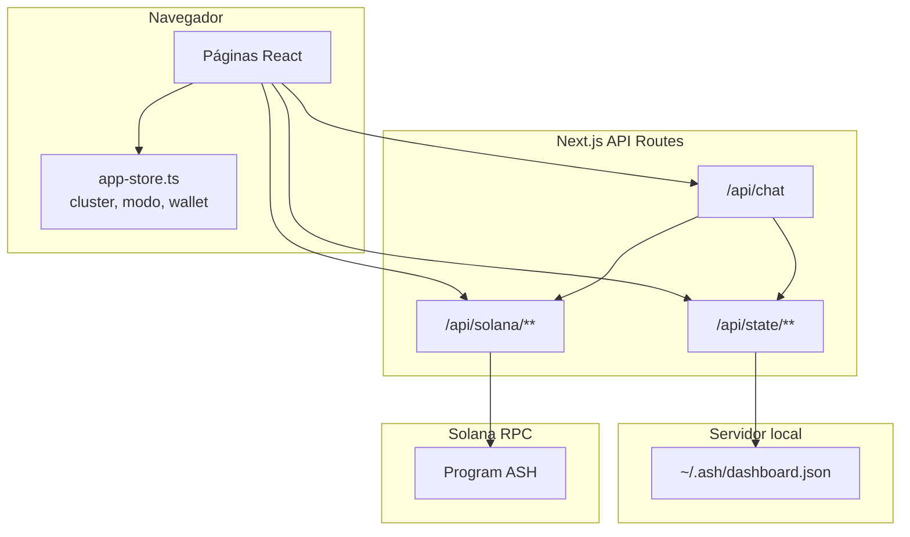
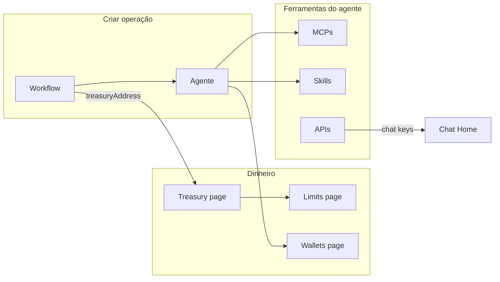

# ASH Dashboard — Fluxos por página

**Criado:** 2026-09-20  
**Pacote:** `packages/dashboard` (`@ash/dashboard`)

Documento de referência que descreve **o que cada página faz** e **qual o fluxo do usuário** (carregamento, ações, persistência e integrações on-chain). Complementa o [handoff de implementação](./dashboard-handoff.md).

---

## Visão geral da arquitetura



### Camadas de dados

| Camada | Onde vive | O que contém |
|---|---|---|
| **Estado local (Zustand)** | `src/stores/app-store.ts`, persistido no browser | Cluster (devnet/testnet/mainnet), RPC customizado, modo de operação (native / ash), wallet conectada, modelo de chat selecionado |
| **Estado do dashboard (servidor)** | `~/.ash/dashboard.json` | Workflows, agentes, MCPs, skills, chaves de API (valor real), perfil, settings |
| **Leituras on-chain** | RPC via `@ash/sdk` | Saldos SOL, saldo do `sol_vault`, Treasury, Policy, AgentSession |

### Hooks centrais

| Hook | Função |
|---|---|
| `useDashboardState()` | GET `/api/state` — estado completo mascarado |
| `useWorkflows()` | Compõe workflows + agentes + saldos (store + RPC) |
| `useWallets()` | Deriva lista unificada: cofre, agente, owner |
| `useCreateResource` / `useUpdateResource` / `useDeleteResource` | CRUD em `/api/state/[resource]` |
| `useTreasury(address)` | GET `/api/solana/treasury` — policy e sessões on-chain |
| `useBalances` / `useVaultBalances` | POST saldos reais, refetch a cada 30s |

### Navegação (shell simples + Avançado)

Dois níveis na sidebar (`nav-items.ts`, `docs/product/simple-shell.md`):

1. **Simples** (sempre visível) — `/` (Chat), `/balance` (Saldo), `/account` (Conta)
2. **Avançado** (recolhido até o usuário abrir; abre sozinho dentro de uma rota avançada)
   - **Workflows** — `/advanced` (visão geral, o antigo `/`), `/templates`, `/workflows`, `/reviews`
   - **Agentes** — `/agents`, `/mcps`, `/skills`, `/knowledge`, `/apis`
   - **Carteiras** — `/metrics`, `/treasury` (Pro), `/limits`, `/wallets` (Pro)
   - **Configurações** — `/profile`, `/settings`

O selo **Pro** só aparece para quem o gate da ADR-024 recusaria; a rota continua aberta.
`NEXT_PUBLIC_DASHBOARD_SHELL=operator` (build) devolve o `/` antigo.

> **Podadas:** `/harness`, `/rag` e `/integrations` foram removidas junto com suas
> entradas de navegação — nenhuma tinha infraestrutura de backend por trás, e uma
> entrada na sidebar é uma promessa. As coleções `rag` e `integrations` seguem no
> schema para que um `dashboard.json` existente continue a fazer parse.

### Controles globais (header)

Nas rotas simples (`/`, `/balance`) o header mostra só o saldo de crédito e **Adicionar saldo**.
Em todas as outras rotas, os controles abaixo:

| Controle | Efeito |
|---|---|
| Seletor de rede | `setCluster` — altera RPC em todas as leituras on-chain |
| Modo Solana Nativo / ASH Vault | `setOperationMode` — preferência de fluxo de pagamento (UI; integração completa ainda em aberto) |
| Connect Wallet | Phantom / Solflare / Backpack → endereço no Zustand |

---

## 1. Home (`/`)

> Desde o shell simples, `/` é chat + saldo + extrato curto (ver `docs/product/simple-shell.md`).
> A página descrita nesta seção vive agora em **`/advanced`** — ou em `/` quando o build usa
> `NEXT_PUBLIC_DASHBOARD_SHELL=operator`.

### O que faz

Página **chat-first**: painel de conversa com assistente à esquerda e lista de workflows com agentes à direita. É o ponto de entrada principal para operar e criar workflows sem sair da conversa.

### Fluxo de carregamento

```
Usuário abre /
    → useWorkflows() busca GET /api/state
    → useBalances + useVaultBalances consultam RPC (se endereços existirem)
    → useChatProviders() detecta provedores de LLM disponíveis
    → Renderiza ChatPanel + lista de WorkflowRow (ou EmptyState)
```

### Fluxos do usuário

#### 1.1 Chat com assistente

```
Digitar mensagem → Enter ou botão Enviar
    → POST /api/chat (streaming)
        body: { messages, model, cluster, rpc }
    → Resposta streamed token a token no painel
    → Badge indica modo: claude-cli | anthropic-api | demo
```

- **Provedores:** Claude Code local (assinatura), API Anthropic, ou modo demo explícito.
- **Ferramentas do chat:** somente leitura (listar treasuries, explicar conceitos, etc.) — nunca withdraw, policy, unpause ou create_session.
- **Cancelar:** botão Stop aborta o fetch via `AbortController`.

#### 1.2 Criar workflow

```
Botão "Novo" (header da coluna workflows)
    → CreateWorkflowDialog
    → Preenche: nome, descrição, ícone, endereço treasury (opcional)
    → POST /api/state/workflows
    → Toast de sucesso; lista atualiza
```

#### 1.3 Adicionar agente a um workflow

```
Botão "+" em WorkflowRow
    → CreateAgentDialog (workflow pré-selecionado)
    → Preenche: nome, cargo, workflow, limite diário USD, wallet (opcional)
    → POST /api/state/agents
    → AgentCard aparece na row
```

#### 1.4 Visualizar agentes

```
Scroll horizontal nos cards de cada workflow (estilo Netflix)
    → AgentCard mostra: status, saldo, limite restante, wallet truncada
    → Clique no card abre EditAgentDialog
```

#### 1.5 Editar workflow ou agente

```
WorkflowRow → ícone lápis  → EditWorkflowDialog → PATCH /api/state/workflows/:id
AgentCard   → clique       → EditAgentDialog    → PATCH /api/state/agents/:id
```

### APIs envolvidas

| Método | Rota | Uso |
|---|---|---|
| GET | `/api/state` | Workflows e agentes |
| POST | `/api/state/workflows` | Criar workflow |
| POST | `/api/state/agents` | Criar agente |
| PATCH | `/api/state/workflows/:id` | Editar workflow |
| PATCH | `/api/state/agents/:id` | Editar agente |
| POST | `/api/chat` | Conversa |
| GET | `/api/chat/providers` | Modelos disponíveis |
| POST | `/api/solana/balances` | Saldos de wallets |
| POST | `/api/solana/vault-balances` | Saldos dos cofres |

---

## 2. Workflows (`/workflows`)

### O que faz

Visão dedicada à **gestão de workflows** (projetos/empresas). Mesma lista da Home, sem o chat — foco em criar, editar, expandir e remover workflows e seus agentes.

### Fluxo de carregamento

Idêntico à Home para a coluna de workflows: `useWorkflows()` → estado + RPC.

### Fluxos do usuário

#### 2.1 Criar workflow

```
PageHeader → "Novo workflow"
    → CreateWorkflowDialog → POST /api/state/workflows
```

Campos: nome, descrição, ícone (emoji), endereço treasury opcional, cluster e owner da wallet conectada.

#### 2.2 Adicionar agente

```
WorkflowRow → "Adicionar agente"
    → CreateAgentDialog com defaultWorkflowId
    → POST /api/state/agents
```

#### 2.3 Editar workflow

```
WorkflowRow → ícone lápis
    → EditWorkflowDialog (montado com key={workflow.id})
    → PATCH /api/state/workflows/:id { name, description, icon, treasuryAddress }
    → useUpdateResource grava o estado devolvido em queryClient.setQueryData(["state"])
      → a linha rerenderiza sem refetch
```

Campos: nome, descrição, ícone e `treasuryAddress`. O endereço é validado contra
base58 antes de poder ser salvo — um valor malformado iria direto ao RPC como
argumento de `getAccountInfo`. Campo vazio desliga o workflow do cofre on-chain:
a UI passa a mostrar `unknown` em vez de um saldo velho.

> Trocar `treasuryAddress` muda a chave das queries `vault-balances` e `treasury`
> (o endereço faz parte do `queryKey`), então o saldo e a policy do novo cofre são
> buscados automaticamente.

#### 2.4 Remover workflow

```
WorkflowRow → ícone lixeira
    → confirm()
    → DELETE /api/state/workflows/:id
    → Remove workflow e agentes associados (cascata no servidor)
```

#### 2.5 Navegar agentes

```
Scroll horizontal nos AgentCards dentro de cada row
    → Setas aparecem no hover quando há overflow
```

### Estado vazio

Sem workflows → `EmptyState` com CTA para abrir `CreateWorkflowDialog`.

### Relação com on-chain

- Workflow **off-chain** (organização lógica).
- Campo `treasuryAddress` liga a um Treasury PDA real quando preenchido ou via CLI `pnpm ash init`.
- Saldo exibido vem do PDA `sol_vault`, não da conta Treasury.

---

## 3. Agents (`/agents`)

### O que faz

Visão em **grade de todos os agentes**, agrupados por workflow. Permite editar, pausar/ativar e remover agentes — controle operacional centralizado.

### Fluxo de carregamento

```
useWorkflows()
    → Filtra workflows com agents.length > 0
    → Renderiza seções por workflow com grid de AgentCard
```

### Fluxos do usuário

#### 3.1 Criar agente

```
"Novo agente" (desabilitado se não houver workflows)
    → CreateAgentDialog
    → POST /api/state/agents (status: active por padrão)
```

#### 3.2 Editar agente

```
Clique no card (ou ícone lápis)
    → EditAgentDialog (montado com key={agent.id})
    → PATCH /api/state/agents/:id { name, role, dailyLimitUsd, walletAddress }
    → Estado devolvido entra no cache; o card rerenderiza na hora
```

Campos: nome, cargo, limite diário (USD) e wallet do agente. O workflow aparece
como leitura apenas — mover um agente entre workflows mexeria em `receivesFrom` e
fica fora do dialog. `walletAddress` passa pela mesma validação base58 do treasury.

> O limite editado aqui é rótulo de UI. O limite que vale é a policy on-chain,
> definida pelo operador dentro do teto do owner — o dialog diz isso.

#### 3.3 Pausar / ativar

```
Botão Pausar/Ativar no card
    → PATCH /api/state/agents/:id { status: "paused" | "active" }
    → Toast confirma mudança
```

> **Nota:** Pausar no dashboard persiste no store local. Revogar sessão on-chain é responsabilidade do operador via CLI/programa.

#### 3.4 Remover agente

```
Ícone lixeira → confirm()
    → DELETE /api/state/agents/:id
```

### Estado vazio

- Sem agentes mas com workflows → CTA "Criar agente".
- Sem workflows → empty state sem ação (precisa criar workflow primeiro).

### O que cada AgentCard mostra

Nome, cargo, status (ativo/pausado), saldo (chain/demo/unknown), limite diário restante, endereço da wallet, destinos `paysTo`, badge demo se aplicável.

---

## 4. Treasury (`/treasury`)

### O que faz

Visão dos **cofres (vaults)** por workflow: saldo, endereço, ligação on-chain, detalhes de policy e sessões.

### Fluxo de carregamento

```
useWorkflows() + vault balances via RPC
    → Grid de cards, um por workflow
```

### Fluxos do usuário

#### 4.1 Atualizar saldos

```
Botão refresh
    → balances.refetch() + vaults.refetch()
```

#### 4.2 Criar novo cofre (workflow)

```
"Novo vault" → CreateWorkflowDialog
    (workflow = unidade de cofre na UI)
```

#### 4.3 Copiar endereço do treasury

```
Click no endereço truncado
    → copyToClipboard → toast
```

#### 4.4 Ver policy e sessões on-chain

```
"Ver policy e sessões" (só se treasuryAddress existe)
    → TreasuryDetail dialog
    → GET /api/solana/treasury?cluster=&address=
    → Exibe: saldo sol_vault, paused, owner, operator,
              sessões ativas, policies, limites por mint
```

#### 4.5 Abrir no explorer

```
Link externo → Solana Explorer (cluster atual)
```

#### 4.6 Treasury não conectado → criar cofre on-chain (ADR-021 onda 2A)

```
Sem treasuryAddress (e workflow não-demo, carteira conectada):
    → Botão "Criar cofre on-chain" → BootstrapWizard (5 passos)
        1. Rede: cluster + RPC das Configurações, carteira que vira owner/operator
           (mainnet bloqueada na UI — usar ash init)
        2. Limites: nome da policy, SOL por pagamento / por dia / total
           (mesmos valores viram teto do owner E policy do operator)
        3. Primeiro destino (opcional): manual (rótulo + carteira) ou
           preset "Vendors devnet" → GET /api/solana/bootstrap/vendors
           (lê /catalog de vendor-{oracle,notary,compute}.ash.app.br; se falhar, manual)
        4. Fundos: meta do cofre em SOL (shortfall, igual ao CLI) +
           primeiro agente opcional (chave de sessão gerada no navegador)
        5. Revisar e assinar:
           → POST /api/solana/bootstrap/plan (passos que faltam on-chain, custo)
           → loop: POST /api/solana/bootstrap/build-step
                   → (passo "treasury": navegador assina com a create_key antes da carteira)
                   → carteira signAndSendTransaction
                   → POST /api/solana/confirm
             até { done: true }
    → Assim que a tesouraria existe: PATCH workflow.treasuryAddress
    → Fim: toast + links para Tesouraria e Limites
           (+ diálogo de entrega da chave de sessão, se houve agente)
Sem carteira: botão desabilitado + "Conecte uma carteira para criar o cofre."
```

Os passos são os do `ash init` (`@ash/cli/bootstrap`), não uma cópia.
Se a configuração parar no meio, o drawer "Ver policy e sessões" mostra
**Concluir configuração** enquanto a tesouraria não tiver policy; o assistente retoma a
partir do que já existe on-chain.

### O que ainda não existe

- Editor de allowlist, editor de policy, pause/unpause, revogar sessão (ondas 2B/2C).
- Mints SPL e mainnet no assistente (hoje via CLI).

---

## 5. Limits (`/limits`)

### O que faz

Visualização de **limites de gasto**: barras de progresso (CeilingMeter) mostrando teto owner, policy operator e gasto atual. Diferencia dados on-chain vs limites só do dashboard.

### Fluxo de carregamento

```
Por workflow:
    → useTreasury(treasuryAddress) se endereço existe
    → Renderiza OnChainLimits OU limites demo/dashboard
```

### Fluxos do usuário

#### 5.1 Com treasury on-chain

```
Card do workflow → badge "On-chain"
    → Para cada Policy:
        → Por mint: 4 CeilingMeters
            - Janela curta (short window)
            - Janela longa (long window)
            - Lifetime da sessão
            - Por transação (spent = 0, é teto)
    → Legenda: ceiling (owner) vs policy (operator) vs spent
```

Dados vêm de `GET /api/solana/treasury` — policies, mints, ceilings, contadores de spend das sessões.

#### 5.2 Sem treasury on-chain

```
Badge "Só dashboard"
    → CeilingMeter por agente com dailyLimitUsd e spentUsd demo
    → Nota: "limite apenas no dashboard"
```

#### 5.3 Estado vazio

Sem workflows → EmptyState.

### Sem ações de escrita

Página **somente leitura** — alterar policy/ceiling é via operador/owner on-chain ou CLI, não pela UI.

---

## 6. Wallets (`/wallets`)

### O que faz

Inventário unificado de **todas as carteiras** conhecidas pelo dashboard, agrupadas por tipo.

### Fluxo de carregamento

```
useWallets()
    → Deriva de useWorkflows() + wallet conectada (Zustand)
    → Seções: Cofre | Agente | Sua wallet
```

### Tipos de wallet

| Tipo | Origem | Saldo |
|---|---|---|
| `treasury` | `workflow.treasuryAddress` | Saldo do `sol_vault` |
| `agent` | `agent.walletAddress` | SOL na wallet da sessão |
| `owner` | Wallet conectada no header | SOL via RPC |

### Fluxos do usuário

#### 6.1 Copiar endereço

```
Botão Copy → clipboard → toast
    (desabilitado se endereço não provisionado)
```

#### 6.2 Abrir no explorer

```
Link externo (se address existe)
```

#### 6.3 Ver limite restante (agentes)

```
Se dailyLimitUsd > 0:
    → "Hoje: restante $X"
```

### Estado vazio

Sem workflows e sem wallet conectada → EmptyState.

---

## 7. MCPs (`/mcps`)

### O que faz

Catálogo de **servidores MCP** (Model Context Protocol) que os agentes podem usar — equivalente a uma "loja de ferramentas".

### Fluxo de carregamento

```
useDashboardState() → data.mcps[]
    → Lista de cards com nome, escopo, descrição
```

### Fluxos do usuário

#### 7.1 Adicionar MCP

```
"Adicionar MCP" → Dialog
    → nome, descrição, escopo (global | workflow | agent)
    → POST /api/state/mcps { enabled: false, demo: false }
```

#### 7.2 Habilitar / desabilitar

```
Switch → PATCH /api/state/mcps/:id { enabled }
```

#### 7.3 Remover

```
Ícone lixeira → DELETE /api/state/mcps/:id
```

### Escopos

| Escopo | Significado na UI |
|---|---|
| `global` | Disponível para todos os agentes |
| `workflow` | Restrito a um workflow (`scopeName`) |
| `agent` | Restrito a um agente específico |

### Limitações

- Não gera snippet de config MCP pós-init automaticamente (roadmap).
- Toggle persiste no JSON local; não inicia/para processo MCP real.

---

## 8. Skills (`/skills`)

### O que faz

Biblioteca de **habilidades** (instruções reutilizáveis para agentes), inspirada em Cursor Skills. Organizada por escopo.

### Fluxo de carregamento

```
useDashboardState() → data.skills[]
    → Tabs: Global | Por workflow | Por agente
```

### Fluxos do usuário

#### 8.1 Criar skill

```
"Nova skill" → Dialog
    → ícone (emoji), nome, descrição, escopo
    → POST /api/state/skills { enabled: true }
```

#### 8.2 Habilitar / desabilitar

```
Switch → PATCH /api/state/skills/:id { enabled }
```

#### 8.3 Remover

```
DELETE /api/state/skills/:id
```

#### 8.4 Filtrar por aba

```
Tab Global → skills.filter(scope === "global")
Tab Por workflow → scope === "workflow"
Tab Por agente → scope === "agent"
```

---

## 9. APIs (`/apis`)

### O que faz

Gestão de **chaves de API** para provedores externos (Anthropic, OpenAI, Helius, etc.). Chaves ficam no servidor; o browser só vê máscara.

### Fluxo de carregamento

```
useDashboardState() → data.apiKeys[]
    → Cards por provider com keyMasked e status
```

### Fluxos do usuário

#### 9.1 Adicionar chave

```
"Adicionar provider" → Dialog
    → provider (select), secret (password input)
    → POST /api/state/apiKeys { provider, secret }
    → Servidor armazena valor real; resposta traz keyMasked
```

#### 9.2 Visualizar máscara

```
Campo read-only com keyMasked (ex: sk-ant-…xxxx)
    → Toggle olho alterna type password/text
    → Valor real NUNCA chega ao navegador
```

#### 9.3 Remover chave

```
DELETE /api/state/apiKeys/:id
```

### Banner de segurança

Card destacado explica que secrets são server-side only.

---

## 10. Account (`/account`)

### O que faz

Gestão de **identidade**: wallet conectada e placeholder para login email/Google.

### Fluxo de carregamento

```
Lê walletAddress e walletName do Zustand
    → Dois cards: Identidade | Email/Google
```

### Fluxos do usuário

#### 10.1 Conectar wallet

```
Sem wallet → ConnectButton
    → Dialog: Phantom / Solflare / Backpack
    → provider.connect() → setWallet(pubkey, name)
    → Toast "Wallet conectada"
```

#### 10.2 Desconectar wallet

```
Botão Desconectar
    → provider.disconnect() + setWallet(null)
    → Toast confirma
```

#### 10.3 Login email/Google

```
Card informativo: "Não implementado"
    → Sem botão funcional (auth falso foi removido)
```

---

## 11. Profile (`/profile`)

### O que faz

Edição do **perfil off-chain** do usuário (nome, empresa, bio, email). Wallet aparece como read-only.

### Fluxo de carregamento

```
useDashboardState() → data.profile
    → Preenche form local (displayName, company, bio, email)
```

### Fluxos do usuário

#### 11.1 Editar campos

```
Input/Textarea → setDirty(true)
    → Avatar mostra inicial do displayName
```

#### 11.2 Salvar

```
Botão Salvar (só ativo se dirty)
    → PATCH /api/state { profile: form }
    → Toast "Perfil salvo"
    → dirty = false
```

#### 11.3 Wallet primária

```
Campo read-only: nome da wallet + endereço truncado
    (vem do Zustand, não editável aqui)
```

---

## 12. Settings (`/settings`)

### O que faz

Preferências de **rede Solana**, idioma, alertas, export/import de configuração e reset.

### Fluxo de carregamento

```
Zustand: cluster, customRpc
useDashboardState() → data.settings
```

### Fluxos do usuário

#### 12.1 Trocar cluster

```
Select devnet / testnet / mainnet-beta
    → setCluster → afeta todas as leituras RPC
```

#### 12.2 RPC customizado

```
Input URL → onBlur → setCustomRpc
    → "Testar conexão"
    → POST /api/solana/rpc-health { cluster, rpc }
    → Toast ok/falha com detalhe
```

#### 12.3 Idioma

```
Select en | pt-BR
    → PATCH /api/state { settings: { ...settings, language } }
    → UI re-renderiza via LocaleProvider
```

#### 12.4 Alertas de limite

```
Switch limitAlerts → PATCH settings
```

#### 12.5 Notificações por email

```
Switch desabilitado (não implementado)
```

#### 12.6 Exportar configuração

```
"Exportar configuração"
    → JSON.stringify(data) → download ash-dashboard.json
```

#### 12.7 Restaurar padrões

```
confirm() → DELETE /api/state
    → Reseta ~/.ash/dashboard.json para seed
    → Toast confirma
```

---

## Diagrama de fluxos cruzados



### Jornada típica do usuário

```
1. Conectar wallet          → Account ou Header
2. Criar workflow           → Home ou Workflows
3. (Opcional) Ligar treasury → CLI init ou campo no dialog
4. Criar agentes            → Home, Workflows ou Agents
5. Configurar ferramentas   → MCPs, Skills, APIs
6. Monitorar cofre/limites  → Treasury, Limits, Wallets
7. Conversar com assistente → Home (Chat)
```

---

## Matriz resumo: página × ações × persistência

| Página | Leitura | Escrita | On-chain | Local (JSON) | Zustand |
|---|---|---|---|---|---|
| `/` | workflows, chat | criar/editar workflow e agente | saldos | sim | cluster, model |
| `/workflows` | workflows | CRUD workflow, criar/editar agente | saldos vault | sim | — |
| `/agents` | agentes | criar, editar, pausar, remover | saldos wallet | sim | — |
| `/treasury` | workflows, treasury detail | criar workflow | vault, policy, sessions | sim | cluster |
| `/limits` | policy, agent limits | — | treasury read | — | — |
| `/wallets` | wallets derivadas | — | saldos | — | owner wallet |
| `/mcps` | mcps | CRUD, toggle | — | sim | — |
| `/skills` | skills | CRUD, toggle | — | sim | — |
| `/apis` | keys masked | add, remove | — | sim (secret server) | — |
| `/account` | wallet | connect/disconnect | — | — | wallet |
| `/profile` | profile | save profile | — | sim | wallet read |
| `/settings` | settings | patch settings, reset | rpc-health | sim | cluster, rpc |

---

## Referências

| Recurso | Caminho |
|---|---|
| Handoff completo | `docs/product/dashboard-handoff.md` |
| Nav items | `packages/dashboard/src/components/layout/nav-items.ts` |
| Hooks de dados | `packages/dashboard/src/hooks/use-dashboard.ts` |
| Schema Zod | `packages/dashboard/src/lib/schema.ts` |
| Store servidor | `packages/dashboard/src/lib/server/store.ts` |
| API state | `packages/dashboard/src/app/api/state/` |
| API Solana | `packages/dashboard/src/app/api/solana/` |
| API chat | `packages/dashboard/src/app/api/chat/` |
